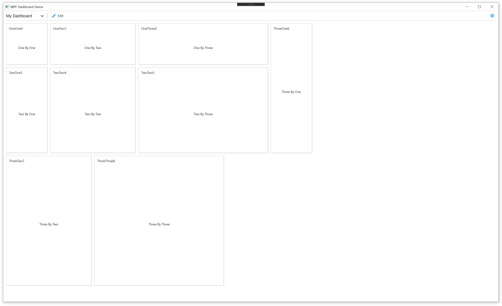
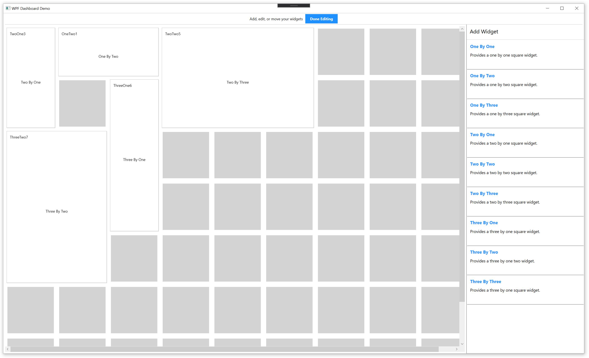

# WpfDashboardControl

Wpf Dashboard Control that allows for dynamically generated widgets and positioning the widgets. The control was heavily inspired by Azure DevOps Server Dashboards and has very similar functionality as it relates to widget placement/movement.

This is **NOT** a stand-alone user control that can be referenced directly. Instead, it is a solution containing the custom control. From there, you'll need to customize it to your likings and create your own version from it to include in your libraries. The hard work is basically done for you and customizing certain aspects of the control shouldn't be too difficult.

I had issues finding a similar control out in the wild that had differing widget sizes for controls. The closest was [Blacklight-Toolkit](https://github.com/jogibear9988/Blacklight-Toolkit/tree/master/Blacklight.Controls.Wpf) but lacked the ability for each widget to have its own size and would automatically resize each widget based on quantity of columns and rows.

The Dashboard Control itself isn't utilizing MVVM since it requires a lot of knowledge about itself. However, the Widgets themselves are made using MVVM. Once you create the Dashboard Control to your specifications it should be quite easy to make your Widgets utilizing the MVVM pattern.

I have heavily documented almost every aspect of this control so you can understand what is actually happening and why it is happening within the code. 

# How-To Run

1. Open the solution file
2. Build the solution
3. Debug/Run .exe in bin

# The UI

Once you're running the WpfDashboardControl, you can't do much until you put it in **Edit** mode. You can put it into **Edit** mode by clicking the **Edit** button at the top of the window. Once you're in **Edit** mode, you can add various widgets by using the buttons at the bottom. Also, while in **Edit** mode, you can move widgets around by drag and drop. Once you are done, you can hit the **Done Editing** button.

As you drag around widgets you'll notice other widgets will begin to interact with the dragging widget by moving down/up in rows. Again, this was modelled off of the Azure DevOps Server Dashboards where it tries to fill in empty spaces.

# Screenshots

Dashboard with widgets:

**Edit** mode:

Dragging a widget:

